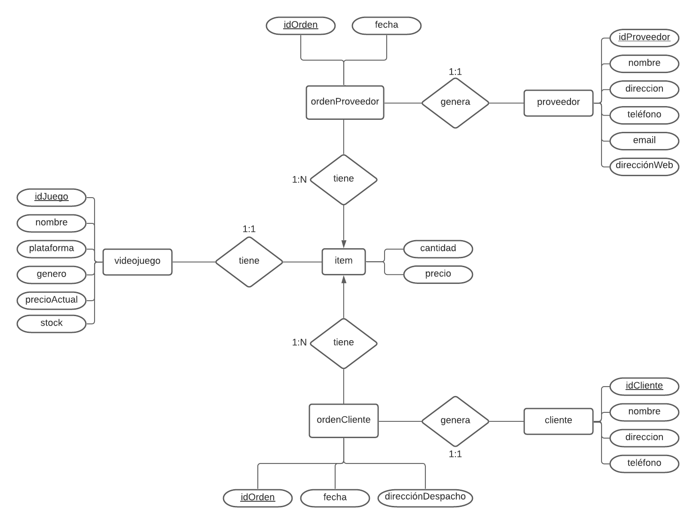

Actividades del día 4, semana 7.

(Jueves 10 de junio de 2021)

---

Hoy aprendimos el uso de `HAVING`en consultas, y aprendimos sobre el modelo conceptual de una base de datos (modelo entidad-relación). Buscando más información vi que hay varias notaciones distintas, y la que usamos en clase corresponde a la de Chen, llamada así por Peter Chen, quien definió formalmente el [modelo entidad relación](https://es.wikipedia.org/wiki/Modelo_entidad-relaci%C3%B3n) y su correspondiente notación en 1976. La noción de los elementos básicos del modelo (entidades, relaciones y atributos) es sencilla, pero entender cómo usar estos elementos para construir un modelo con algún nivel de complejidad no lo es, y requiere estudio y práctica.

---

### Ejercicio 1: Crear las siguientes consultas.

#### 1.1 Determinar nombre, apellidos, cargo y departamento al cual pertenece l empleado con el mayor sueldo.
```SQL
SELECT nombre, apellidoP, apellidoM, cargo, departamento
FROM empleado
WHERE sueldo =
    (
    SELECT MAX(sueldo)
    FROM empleado
    );
```

#### 1.2 Determinar nombre, apellidos, cargo y departamento al cual pertenece el empleado con el menor sueldo.
```SQL
SELECT nombre, apellidoP, apellidoM, cargo, departamento
FROM empleado
WHERE sueldo = 
    (
	SELECT MIN(sueldo)
    FROM empleado
    );
```

#### 1.3 Determinar cuántos empleados hay por departamento dentro de la empresa.
```SQL
SELECT departamento, COUNT(*)
FROM empleado
GROUP BY departamento
ORDER BY COUNT(*) DESC;
```

#### 1.4 Determinar cuánto es el gasto total mensual en sueldos dentro de la empresa.
```SQL
SELECT SUM(sueldo)
FROM empleado;
```

#### 1.5 Agrupar por editorial y determinar cuántos libros pertenecen a cada una.
```SQL
SELECT editorial, COUNT(*)
FROM libro
GROUP BY editorial
ORDER BY COUNT(*) DESC;
```

#### 1.6 Determinar la cantidad de libros en existencia dentro de la biblioteca (ejemplares).
```SQL
SELECT SUM(ejemplares)
FROM libro;
```

### Ejercicio 2: Crear consultas usando `HAVING`.
```SQL
SELECT categoria, COUNT(*)
FROM libro
GROUP BY (categoria)
HAVING (categoria LIKE 'Novela%');
```

```SQL
SELECT departamento, AVG(edad)
FROM empleado
GROUP BY departamento
HAVING AVG(edad) >= 40
ORDER BY AVG(edad);
```


### Ejercicio 3: Determinar las entidades necesarias para crear una base de datos en base al siguiente enunciado:

 Una tienda que se dedica a la venta de videojuegos necesita llevar el control de su inventario a través de un sistema que utilice una base de datos. El sistema debe manejar ventas realizadas e imprimir facturas con los datos de los clientes, así como también se deben almacenar las facturas de los proveedores para actualizar las existencias de los productos. El sistema de manera mensual debe generar un reporte sobre las existencias de los productos para realizar un inventario. El sistema debe manejar información global de ventas mensuales y por año, y la existencia general de productos en la tienda.


**Entidades:**
- videojuego
- cliente
- proveedo
- ordenCliente
- ordenProveedor


### Ejercicio 4: Con el ejercicio anterior, usando las entidades identificadas, establecer sus relaciones, tipo de correspondencia (uno a uno, uno a muchos o muchos a muchos) y sus atributos o campos.


