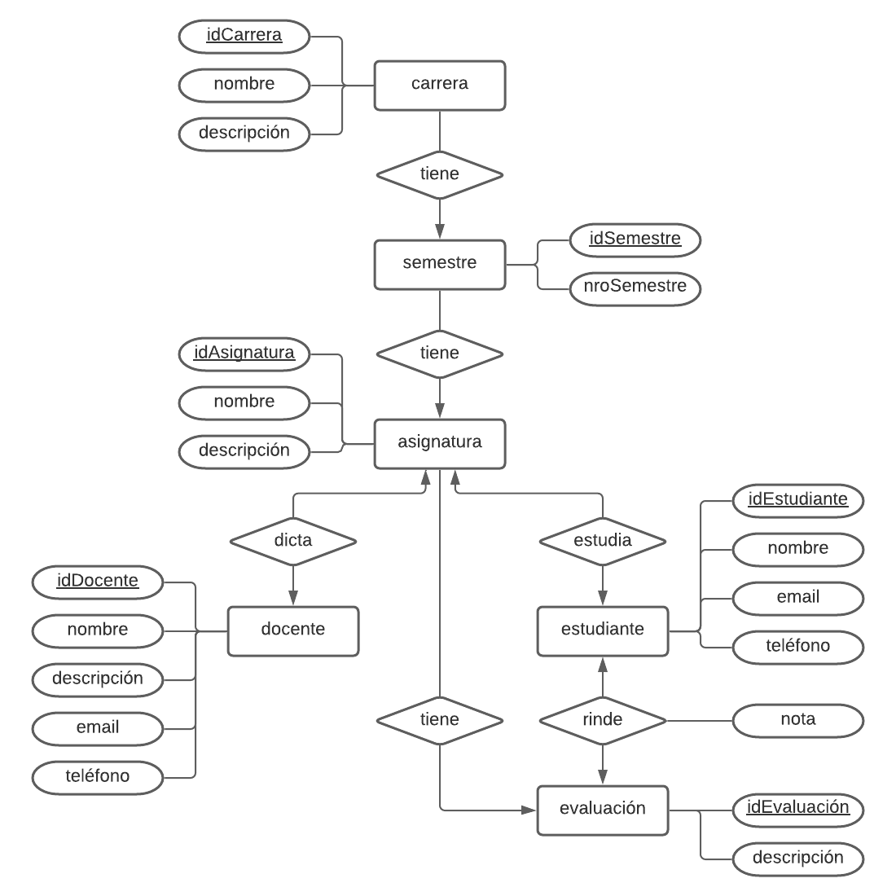

Actividades del día 5, semana 7.

(Viernes 11 de junio de 2021)

---

Definir las entidades y sus atributos no presenta mayor problema, pero definir las relaciones, y especialmente la cardinalidad de cada relación, puede llegar a ser bastante complejo. En especial puede ser confuso definir cuándo una relación es 1 a muchos, o muchos a muchos. Además, buscando información en internet, veo que hay varias formas distintas de representar el modelo entidad-relación, y en especial de representar la cardinalidad. Dentro de las alternativas que he encontrado, una particularmente popular es la notación de patas de gallo, que si bien requiere algo de práctica, se me hace probablemente la más sencilla de entender al interpretar un modelo.

---

### Ejercicio: Realizar modelo entidad-relación.

**Contexto:**

> Una unidad educativa desea llevar el registro de sus estudiantes a través de un sistema. Dicha entidad cuenta con 6 carreras de 10 semestres cada una. Cada semestre tiene 5 asignaturas. Se puede asignar cada docente a una o más asignaturas. El sistema debe llevar un registro curriculas de estudiantes. Docentes realizan 4 evaluaciones por asignatura.

