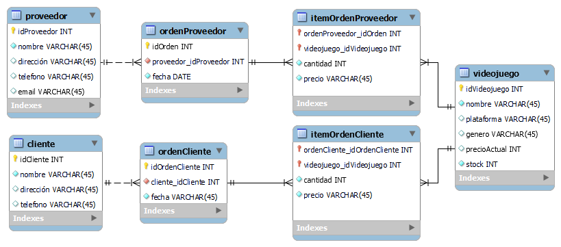
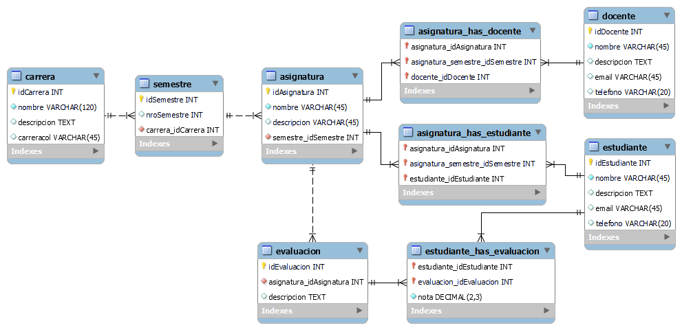

Actividades del día 1, semana 8.

(Lunes 14 de junio de 2021)

---

El generar el modelo relacional con una herramienta como Workbench puede ayudar a entender mejor las relaciones y sus cardinalidades, y descubrir eventuales errores en el modelo entidad-relación.

---

### Ejercicio 1: Crear un modelo relacional en Workbench a partir del modelo entidad-relación creado en clases anteriores para una tienda de videojuegos.

**Contexto:**

>  Una tienda que se dedica a la venta de videojuegos necesita llevar el control de su inventario a través de un sistema que utilice una base de datos. El sistema debe manejar ventas realizadas e imprimir facturas con los datos de clientes. También se deben almacenar las facturas de los proveedores para actualizar las existencias de los productos. El sistema de manera mensual debe generar un reporte sobre las existencias de los productos para realizar un inventario. El sistema debe manejar información global de ventas mensuales y por año, y la existencia general de productos en la tienda. 

### Ejercicio 2: Crear un modelo relacional en Workbench a partir del modelo entidad-relación creado en clases anteriores para una unidad educativa.

**Contexto:**

> Una unidad educativa desea llevar el registro de sus estudiantes a través de un sistema. Dicha entidad cuenta con 6 carreras de 10 semestres cada una. Cada semestre tiene 5 asignaturas. Se puede asignar cada docente a una o más asignaturas. El sistema debe llevar un registro curriculas de estudiantes. Docentes realizan 4 evaluaciones por asignatura.

