## Prueba módulo 2: Lenguaje de consultas a una base de datos

**Nombre:** Sebastián González

### 1. Definir una problemática para implementar una base de datos.

>  Una librería necesita implementar una base de datos para almacenar información sobre su catálogo de libros, clientes y ventas.


### 2. Elaborar el modelo entidad-relación correspondiente.

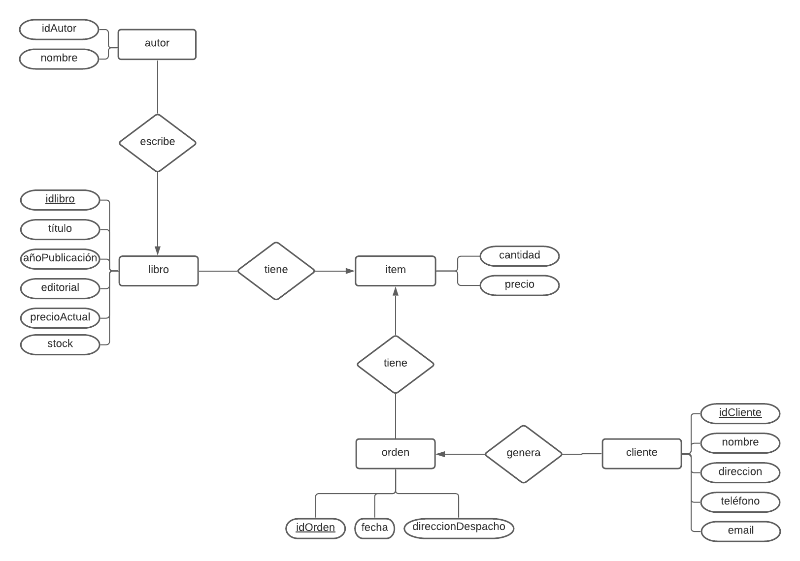

### 3. Elaborar el modelo relacional correspondiente en Workbench.

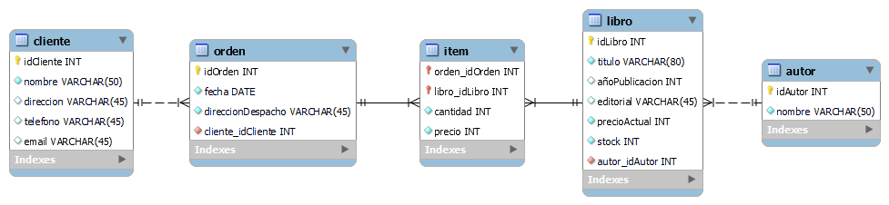

### 4. Copiar el script generado por Workbench.

```SQL
-- MySQL Script generated by MySQL Workbench
-- Fri Jun 18 08:00:22 2021
-- Model: New Model    Version: 1.0
-- MySQL Workbench Forward Engineering

SET @OLD_UNIQUE_CHECKS=@@UNIQUE_CHECKS, UNIQUE_CHECKS=0;
SET @OLD_FOREIGN_KEY_CHECKS=@@FOREIGN_KEY_CHECKS, FOREIGN_KEY_CHECKS=0;
SET @OLD_SQL_MODE=@@SQL_MODE, SQL_MODE='ONLY_FULL_GROUP_BY,STRICT_TRANS_TABLES,NO_ZERO_IN_DATE,NO_ZERO_DATE,ERROR_FOR_DIVISION_BY_ZERO,NO_ENGINE_SUBSTITUTION';

-- -----------------------------------------------------
-- Schema Prueba2
-- -----------------------------------------------------
DROP SCHEMA IF EXISTS `Prueba2` ;

-- -----------------------------------------------------
-- Schema Prueba2
-- -----------------------------------------------------
CREATE SCHEMA IF NOT EXISTS `Prueba2` DEFAULT CHARACTER SET utf8 ;
USE `Prueba2` ;

-- -----------------------------------------------------
-- Table `Prueba2`.`cliente`
-- -----------------------------------------------------
DROP TABLE IF EXISTS `Prueba2`.`cliente` ;

CREATE TABLE IF NOT EXISTS `Prueba2`.`cliente` (
  `idCliente` INT NOT NULL AUTO_INCREMENT,
  `nombre` VARCHAR(50) NOT NULL,
  `direccion` VARCHAR(45) NULL,
  `telefono` VARCHAR(45) NULL,
  `email` VARCHAR(45) NULL,
  PRIMARY KEY (`idCliente`))
ENGINE = InnoDB;


-- -----------------------------------------------------
-- Table `Prueba2`.`orden`
-- -----------------------------------------------------
DROP TABLE IF EXISTS `Prueba2`.`orden` ;

CREATE TABLE IF NOT EXISTS `Prueba2`.`orden` (
  `idOrden` INT NOT NULL AUTO_INCREMENT,
  `fecha` DATE NOT NULL,
  `direccionDespacho` VARCHAR(45) NOT NULL,
  `cliente_idCliente` INT NOT NULL,
  PRIMARY KEY (`idOrden`),
  INDEX `fk_orden_cliente_idx` (`cliente_idCliente` ASC),
  CONSTRAINT `fk_orden_cliente`
    FOREIGN KEY (`cliente_idCliente`)
    REFERENCES `Prueba2`.`cliente` (`idCliente`)
    ON DELETE NO ACTION
    ON UPDATE NO ACTION)
ENGINE = InnoDB;


-- -----------------------------------------------------
-- Table `Prueba2`.`autor`
-- -----------------------------------------------------
DROP TABLE IF EXISTS `Prueba2`.`autor` ;

CREATE TABLE IF NOT EXISTS `Prueba2`.`autor` (
  `idAutor` INT NOT NULL AUTO_INCREMENT,
  `nombre` VARCHAR(50) NOT NULL,
  PRIMARY KEY (`idAutor`))
ENGINE = InnoDB;


-- -----------------------------------------------------
-- Table `Prueba2`.`libro`
-- -----------------------------------------------------
DROP TABLE IF EXISTS `Prueba2`.`libro` ;

CREATE TABLE IF NOT EXISTS `Prueba2`.`libro` (
  `idLibro` INT NOT NULL AUTO_INCREMENT,
  `titulo` VARCHAR(80) NOT NULL,
  `añoPublicacion` INT NULL,
  `editorial` VARCHAR(45) NULL,
  `precioActual` INT NOT NULL,
  `stock` INT NOT NULL,
  `autor_idAutor` INT NOT NULL,
  PRIMARY KEY (`idLibro`),
  INDEX `fk_libro_autor1_idx` (`autor_idAutor` ASC),
  CONSTRAINT `fk_libro_autor1`
    FOREIGN KEY (`autor_idAutor`)
    REFERENCES `Prueba2`.`autor` (`idAutor`)
    ON DELETE NO ACTION
    ON UPDATE NO ACTION)
ENGINE = InnoDB;


-- -----------------------------------------------------
-- Table `Prueba2`.`item`
-- -----------------------------------------------------
DROP TABLE IF EXISTS `Prueba2`.`item` ;

CREATE TABLE IF NOT EXISTS `Prueba2`.`item` (
  `orden_idOrden` INT NOT NULL,
  `libro_idLibro` INT NOT NULL,
  `cantidad` INT NOT NULL,
  `precio` INT NOT NULL,
  PRIMARY KEY (`orden_idOrden`, `libro_idLibro`),
  INDEX `fk_item_orden1_idx` (`orden_idOrden` ASC),
  INDEX `fk_item_libro1_idx` (`libro_idLibro` ASC),
  CONSTRAINT `fk_item_orden1`
    FOREIGN KEY (`orden_idOrden`)
    REFERENCES `Prueba2`.`orden` (`idOrden`)
    ON DELETE NO ACTION
    ON UPDATE NO ACTION,
  CONSTRAINT `fk_item_libro1`
    FOREIGN KEY (`libro_idLibro`)
    REFERENCES `Prueba2`.`libro` (`idLibro`)
    ON DELETE NO ACTION
    ON UPDATE NO ACTION)
ENGINE = InnoDB;


SET SQL_MODE=@OLD_SQL_MODE;
SET FOREIGN_KEY_CHECKS=@OLD_FOREIGN_KEY_CHECKS;
SET UNIQUE_CHECKS=@OLD_UNIQUE_CHECKS;
```

### 5. Crear registros en la base de datos.

```SQL
INSERT INTO cliente (nombre)
VALUES
  ('Charlie Evans Thompson')
, ('Max Jiménez Ximénez')
, ('Alex Bascuñán Quevedo')
, ('Jessie Cameron')
, ('Francis Fuentes Urdemales')
, ('Inti González Veloso')
, ('Kelly Taylor')
, ('Robin López Zavala')
, ('Taylor Kelly')
, ('Alexis Rojas Contreras')
, ('Leslie Hernández Wagner')
, ('Antu Linconao Lemunkuyen')
, ('Sol Huelet Alen')
, ('Monserrat Keller Yáñez')
, ('Cámeron Donoso Soto')
, ('Cris Tapia Rodríguez')
, ('Cassidy Parker')
, ('Akira Aoki Okada')
, ('Ángel Pérez Araya')
, ('Ariel Cáceres Ríos');

INSERT INTO autor (nombre)
VALUES
  ('Murasaki Shikibu')
, ('Gabriela Mistral')
, ('Mariel Csengery Lorenzi')
, ('Simone de Beauvoir')
, ('Paul Deitel, Harvey Deitel')
, ('Mary Shelley')
, ('Francisco Martorell')
, ('Miguel de Cervantes')
, ('James Heisig, Marc Bernabé, Verónica Calafell')
, ('Alan Moore')
, ('Antoine de Saint-Exupéry')
, ('Marcela Paz')
, ('Alejandra Matus')
, ('J. R. R. Tolkien')
, ('Adrián Dufflocq Galdames')
, ('Barbara Oakley')
, ('Harper Lee')
, ('Agatha Christie')
, ('Bruce Lee')
, ('J.K. Rowling')
, ('Cosme Portocarrero')
, ('Virginia Woolf')
, ('Aristóteles')
, ('Isabel Allende')
, ('Centro de Investigación Periodística (CIPER)')
, ('Alexandre Dumas');


INSERT INTO libro (titulo, autor_idAutor, editorial, añoPublicacion, stock, precioActual)
VALUES
  ('La novela de Genji',1, 'Destino', 2007, 188, 6356)
, ('Lecturas para mujeres destinadas a la enseñanza del lenguaje',2, 'Porrúa', 2005, 65, 18657)
, ('El computador y yo : (manual de autoinstrucción basic-atari)',3, 'Bravo y Allende', 1992, 189, 20292)
, ('El segundo sexo',4, 'Debolsillo', 2008, 69, 45848)
, ('Java: Cómo Programar',5, 'Pearson', 2016, 188, 17600)
, ('Frankenstein',6, 'Alma', 2018, 207, 11522)
, ('Impunidad diplomática',7, 'Planeta', 1993, 368, 33729)
, ('Don Quijote de la Mancha',8, 'Alfaguara', 2005, 264, 10295)
, ('Kanji Para Recordar',9, 'Herder', 2001, 269, 40899)
, ('V de Vendetta',10, 'Norma', 2002, 224, 14212)
, ('El principito',11, 'Zig-Zag', 2019, 370, 46910)
, ('Papelucho',12, 'Rapa-Nui', 1947, 387, 15932)
, ('El libro negro de la justicia chilena',13, 'Planeta', 1999, 185, 8341)
, ('El señor de los anillos I : la Comunidad del Anillo',14, 'Planeta', 2012, 160, 14018)
, ('Silabario Hispanoamericano',15, 'Zig-Zag', 1945, 296, 21180)
, ('Abre tu Mente a Los Números',16, 'RBA', 2015, 392, 34536)
, ('Matar un ruiseñor',17, 'Bruguera ', 1966, 143, 32571)
, ('El asesinato de Roger Ackroyd',18, 'Planeta', 2017, 377, 14981)
, ('El Tao del Jeet Kune Do',19, 'Eyra', 2011, 377, 6595)
, ('Harry Potter y la piedra filosofal',20, 'Penguin Random House', 2020, 11, 44520)
, ('La palabra huevón',21, 'LOM', 1998, 152, 38654)
, ('Un cuarto propio',22, 'Alianza Editorial', 2003, 259, 8414)
, ('Etica Nicomaquea',23, 'Porrúa', 1998, 179, 15383)
, ('La casa de los espíritus',24, 'Penguin Random House', 2019, 365, 23559)
, ('Lo mejor de Ciper 3 : el periodismo que remece a Chile',25, 'Catalonia', 2016, 39, 17298)
, ('El conde de Montecristo',26, 'Plutón', 2018, 100, 20559);


INSERT INTO orden (fecha, direccionDespacho, cliente_idCliente)
VALUES
  ('2021-05-05', 'Gran Avenida 853', 5)
, ('2021-05-12', 'Alameda 466', 8)
, ('2021-05-14', 'José Arrieta 466', 12)
, ('2021-05-30', 'Dublé Almeyda 910', 11)
, ('2021-05-31', 'Balmaceda 920', 2)
, ('2021-06-02', 'Cueto 160', 19)
, ('2021-06-10', 'Ecuador 2990', 5)
, ('2021-06-11', 'Irarrázaval 820', 11)
, ('2021-06-16', 'Huérfanos 203', 5)
, ('2021-06-17', 'Franklin 671', 6);

INSERT INTO item (cantidad, precio, orden_idOrden, libro_idLibro)
VALUES
  (1, 49079, 1, 9)
, (2, 39085, 1, 17)
, (1, 7627, 2, 1)
, (4, 56292, 2, 11)
, (1, 17054, 2, 10)
, (2, 46385, 2, 21)
, (1, 16822, 3, 14)
, (3, 20758, 3, 25)
, (1, 55018, 3, 4)
, (2, 41443, 4, 16)
, (1, 10009, 4, 13)
, (4, 20758, 4, 25)
, (1, 25416, 4, 15)
, (2, 18460, 4, 23)
, (1, 24671, 4, 26)
, (5, 24350, 4, 3)
, (1, 28271, 5, 24)
, (2, 16822, 5, 14)
, (1, 17054, 5, 10)
, (3, 24671, 5, 26)
, (1, 49079, 6, 9)
, (2, 28271, 7, 24)
, (1, 55018, 7, 4)
, (4, 10097, 7, 22)
, (1, 40475, 7, 7)
, (2, 19118, 7, 12)
, (1, 24671, 7, 26)
, (3, 53424, 7, 20)
, (1, 17977, 8, 18)
, (2, 7914, 8, 19)
, (1, 7914, 9, 19)
, (3, 46385, 9, 21)
, (1, 7914, 9, 20)
, (2, 18460, 9, 23)
, (1, 13826, 9, 6)
, (2, 21120, 9, 5)
, (1, 46385, 9, 22)
, (2, 7627, 9, 1)
, (1, 49079, 10, 9)
, (3, 39085, 10, 17);
```

### 6. Realizar consultas utilizando todo lo visto en clases. Dichas consultas deben incluir una descripción, el código SQL y el resultado obtenido.

#### 6.1. Mostrar libros con precio entre $5000 y $10000, ordenados de menor a mayor precio.
```SQL
SELECT titulo, precioActual, stock
FROM libro
WHERE precioActual BETWEEN 5000 AND 10000
ORDER BY precioActual;
```


#### 6.2. Mostrar libros que comiencen con "A".
```SQL
SELECT titulo, precioActual, stock
FROM libro
WHERE titulo LIKE "A%";
```
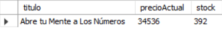

#### 6.3 Mostrar editoriales que comiencen con "P", excepto "Planeta" y "Porrúa".
```SQL
SELECT DISTINCT editorial
FROM libro
WHERE editorial LIKE 'P%' AND editorial NOT IN ('Planeta', 'Porrúa')
ORDER BY editorial;
```
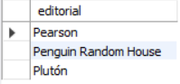

#### 6.4 En preparación para los días Cyber, aumentar el precio actual de todos los libros al doble.
```SQL
UPDATE libro
SET precioActual = precioActual * 2;
```


#### 6.5. Al comenzar los días Cyber, devolver los precios a su valor original.
```SQL
UPDATE libro
SET precioActual = precioActual / 2;
```


#### 6.6. Mostrar total de títulos por editorial, de mayor a menor, sólo para editoriales que tengan más de 1 título.
```SQL
SELECT editorial, COUNT(*) AS ejemplares
FROM libro
GROUP BY editorial
HAVING COUNT(*) > 1
ORDER BY COUNT(*) DESC;
```
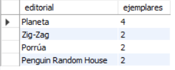

#### 6.7. Mostrar stock de libros por cada editorial, para editoriales con 100 o menos ejemplares.
```SQL
SELECT editorial, SUM(stock)
FROM libro
GROUP BY editorial
HAVING SUM(stock) <= 100
ORDER BY SUM(stock) DESC;
```
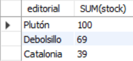

#### 6.8. Mostrar fecha, nombre de cliente, dirección de despacho, teléfono de cliente, email de cliente para la última venta realizada.
```SQL
SELECT fecha, nombre, direccionDespacho, telefono, email
FROM cliente
JOIN orden
ON cliente_idCliente = idCliente
WHERE fecha =
	(
	SELECT MAX(fecha) FROM orden
    );
SELECT * FROM cliente;
```


#### 6.9. Mostrar fecha, nombre de cliente, dirección de despacho, título, cantidad y precio de todas las ventas, desde la última hacia atrás.
```SQL
SELECT 
  fecha, cliente.nombre, direccionDespacho, titulo, cantidad, precio
FROM cliente
JOIN orden
  ON idCliente = cliente_idCliente
JOIN item
  ON idOrden = orden_idOrden
JOIN libro
  ON libro_idLibro = idLibro
ORDER BY fecha DESC;
```
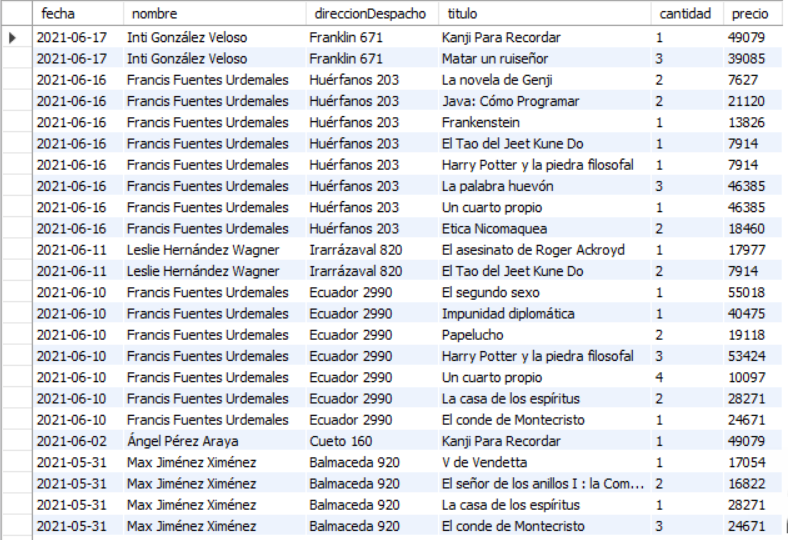
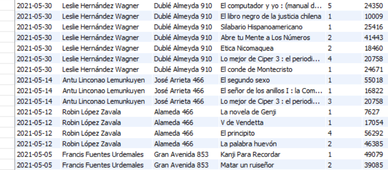

#### 6.10. Mostrar ranking de libros con más ejemplares vendidos. 
```SQL
SELECT titulo, SUM(cantidad)
FROM libro
JOIN item
ON idLibro = libro_idLibro
JOIN orden
on idOrden = orden_idOrden
GROUP BY titulo
ORDER BY SUM(cantidad) DESC;
```
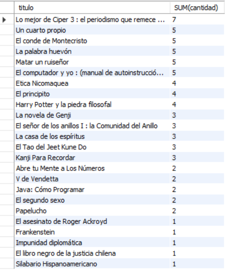

#### 6.11 Mostrar ranking de clientes que han gastado más dinero, con su nombre, total de ejemplares y total de dinero gastado.
```SQL
SELECT nombre, SUM(cantidad) AS 'ejemplares', SUM(precio) AS '$'
FROM cliente
JOIN orden
  ON idCliente = cliente_idCliente
JOIN item
  ON idOrden = orden_idOrden
GROUP BY (fecha), nombre
ORDER BY SUM(precio) DESC;
```
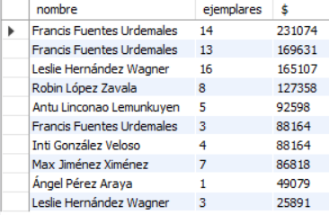

#### 6.12 Mostrar ventas totales (en pesos y en cantidad de libros) por mes.
```SQL
SELECT 
    MONTHNAME(fecha) AS 'mes'
  , SUM(precio) AS 'ventas ($)'
  , SUM(cantidad) AS 'ventas (libros)'
FROM cliente
JOIN orden
  ON idCliente = cliente_idCliente
JOIN item
  ON idOrden = orden_idOrden
JOIN libro
  ON libro_idLibro = idLibro
GROUP BY MONTHNAME(fecha);
```
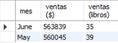

#### 6.13 Mostrar nombres de clientes que hayan efectuado compras entre el 15 y el 31 de mayo de 2021.
```SQL
SELECT fecha, nombre
FROM cliente
JOIN orden
ON cliente_idCliente = idCliente
WHERE fecha BETWEEN '2021-05-15' AND '2021-05-31'
ORDER BY fecha DESC;
```
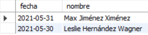

### 7. Crear vistas.

#### 7.1. Mostrar nombre y datos de contacto de clientes.
```SQL
CREATE VIEW contactoClientes AS
SELECT nombre, telefono, email FROM cliente;
```


#### 7.2. Mostrar titulo y autor de libros.
```SQL
CREATE VIEW tituloAutor AS
SELECT titulo, nombre
FROM libro
JOIN autor
ON autor_idAutor = idAutor
ORDER BY titulo;
```
